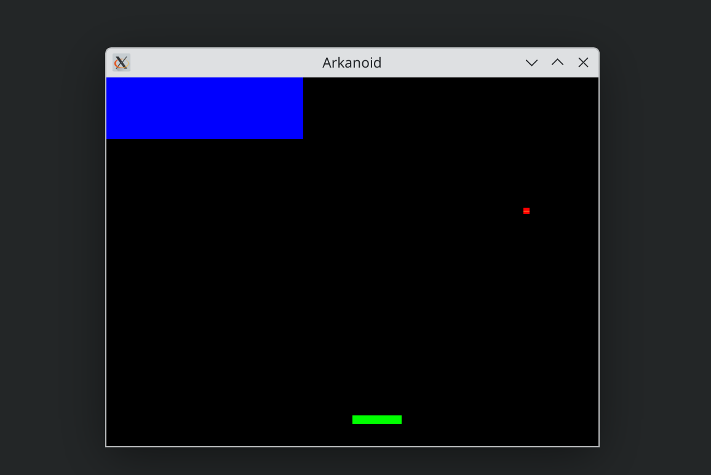
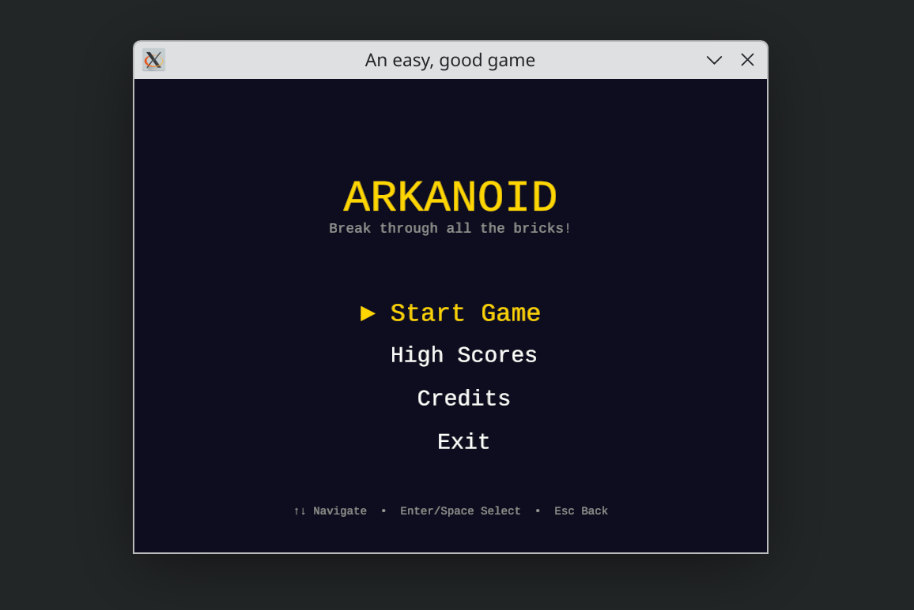
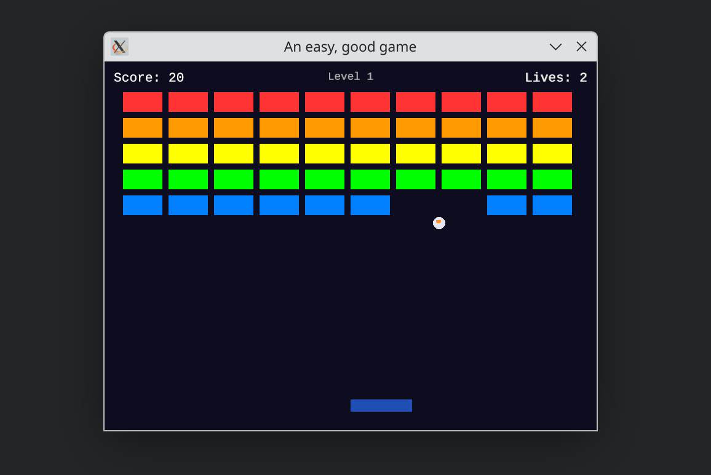
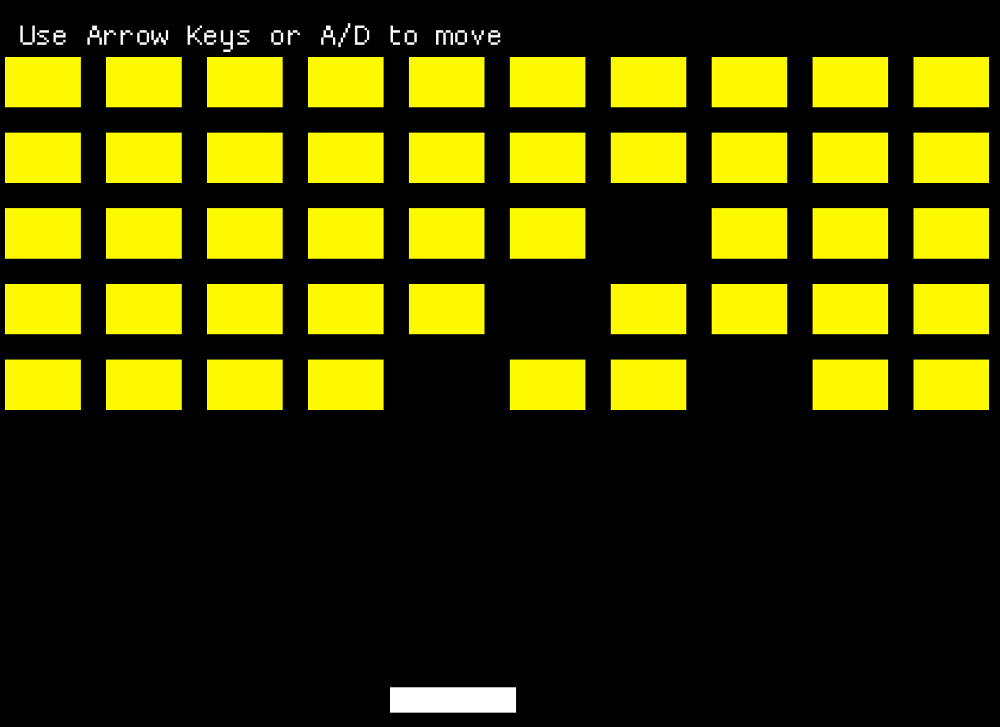

# 📸 Proofs of Concept — PhaseFlow Nano with different models

> Screenshots of the **same project** executed with PhaseFlow Nano using different local models, to compare code quality, phase accuracy, and final results.

---

## Methodology

Each PoC consists of executing the same plan (`plan.md`) with a different model, without manual intervention, documenting:

- **Plan generated** by `phaseflow-planner`
- **Execution** by `phaseflow-builder` / `phaseflow-orchestrator`
- **Results** and generated code quality
- **Number of review cycles** (REQUIRES_FIX)
- **Tokens consumed** and total time

---

## Reference project: ARKANOID Rust Clone

A simple ARKANOID (Breakout) clone written in Rust using the `ggez` game framework.

---

## Devstral Small 2 24B

| Attribute | Value |
|-----------|-------|
| **Model** | `devstral/devstral-small-2-24b` |
| **Plan** | ✅ Generated, 4 phases |
| **Result** | ✅ All phases completed |
| **Screenshot** |  |

---

## Ministral 14B Reasoner Q6

| Attribute | Value |
|-----------|-------|
| **Model** | `mistral/ministral-14b-reasoner` (Q6_K quant) |
| **Plan** | ✅ Generated |
| **Result** | ✅ Completed |
| **Screenshot** |  |

It is not functional. Better to use this model just for planning.
---

## DeepSeek v4 Flash (Cloud | Just for comparison)

| Attribute | Value |
|-----------|-------|
| **Model** | `deepseek/deepseek-v4-flash` |
| **Plan** | ✅ Generated, 4 phases |
| **Result** | ✅ All phases completed |
| **Screenshots** |   |

Obviously the best result — this is a frontier model; this test is just to compare local models.

---

## Gemini 3.1 Flash Lite (Cloud | Just for comparison)

| Attribute | Value |
|-----------|-------|
| **Model** | `google/gemini-3.1-flash-lite` |
| **Plan** | ✅ Generated, 4 phases |
| **Result** | ✅ All phases completed |
| **Screenshots** |  |

---

## Gemma 4 (Local)

| Attribute | Value |
|-----------|-------|
| **Model** | `google/gemma-4` |
| **Plan** | ✅ Generated, 7 phases |
| **Result** | ✅ All phases completed (with some little errors) |
| **Screenshots** |  |

---

## Comparative results

| Aspect | DeepSeek v4 Flash | Gemini 3.1 Flash Lite | Gemma 4 12B | Devstral Small 2 24B | Ministral 14B Reasoner |
|--------|:-----------------:|:---------------------:|:-------:|:--------------------:|:----------------------:|
| Accurate plan | ✅ Yes | ✅ Yes | ✅ Yes| ✅ Yes | ✅ Yes |
| Working code 1st try | ✅ Yes | ✅ Yes | ✅ Yes (+ one prompt to fix syntax error) | ✅ Yes | ✅ Yes |
| Review cycles | ✅ Yes | ✅ Yes |  ✅ Yes | ✅ Yes | ✅ Yes |
| Perceived quality | ✅ High | ✅ High | ⚠️ Medium / Prototype | ⚠️ Medium / Prototype | ❌ Not functional |

---

